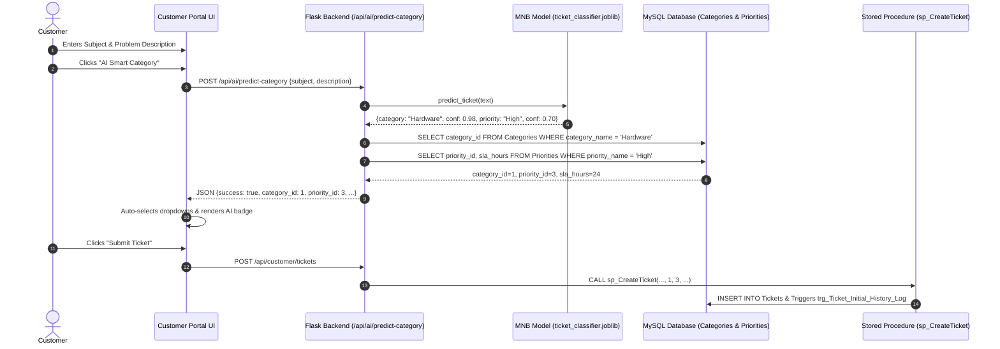

# Customer Support Ticket Management System
## AI / Data Science Component: Backend Integration & UI Connection (Phase 28)

---

### 1. Architectural Overview & System Flow

Phase 28 establishes the bridge between the trained Natural Language Processing (NLP) machine learning pipeline and the operational application layer. 

Incoming support text submitted via the browser or API is passed through the serialized **TF-IDF + Multinomial Naive Bayes** pipeline (`ai/models/ticket_classifier.joblib`). The predicted labels are dynamically resolved against the MySQL `Categories` and `Priorities` tables, and the resulting foreign key IDs are pre-selected in the user interface.



---

### 2. REST API Specifications

#### Endpoint 1: Predict Category & Urgency (`POST /api/ai/predict-category`)
- **Description**: Evaluates raw text and returns the predicted category, recommended priority, database foreign key IDs, confidence scores, and SLA target.
- **Request Headers**: `Content-Type: application/json`
- **Request Body Options**:
  ```json
  {
    "subject": "External monitor not turning on",
    "description": "Connected HDMI cable to workstation but screen is completely black."
  }
  ```
  *(Or alternatively: `{"text": "Full combined problem text..."}`)*

- **Response Body (`200 OK`)**:
  ```json
  {
    "success": true,
    "input_preview": "External monitor not turning on Connected HDMI cable to workstation but screen is completely black.",
    "category_name": "Hardware",
    "category_id": 1,
    "confidence": 0.9837,
    "priority_name": "High",
    "priority_id": 3,
    "priority_confidence": 0.7029,
    "sla_hours": 24
  }
  ```

#### Endpoint 2: Retrieve Active Model Metadata (`GET /api/ai/model-info`)
- **Description**: Returns architectural parameters, vocabulary size, and training evaluation metrics.
- **Response Body (`200 OK`)**:
  ```json
  {
    "status": "loaded",
    "model_info": {
      "model_file": "ticket_classifier.joblib",
      "algorithm": "Multinomial Naive Bayes + TF-IDF (1, 2) n-grams",
      "categories": ["Account", "Hardware", "Network", "Payment", "Software", "Technical Issue"],
      "priorities": ["Critical", "High", "Low", "Medium"],
      "metrics": {
        "category_accuracy": 1.0,
        "priority_accuracy": 0.9375,
        "test_samples": 144,
        "train_samples": 576,
        "vocabulary_size": 3482
      }
    }
  }
  ```

---

### 3. Database Entity Resolution & Foreign Key Alignment

To maintain 3NF database integrity, text predictions must translate into valid foreign keys before reaching `sp_CreateTicket`. 

The controller dynamically queries:
```python
# Resolve Category ID
cat_rows = execute_query(
    "SELECT category_id, category_name FROM Categories WHERE LOWER(category_name) = LOWER(%s) LIMIT 1",
    (category_name,)
)
category_id = cat_rows[0]['category_id'] if cat_rows else 7 # Fallback to Other

# Resolve Priority ID & SLA Hours
prio_rows = execute_query(
    "SELECT priority_id, priority_name, sla_hours FROM Priorities WHERE LOWER(priority_name) = LOWER(%s) LIMIT 1",
    (priority_name,)
)
priority_id = prio_rows[0]['priority_id'] if prio_rows else 2 # Fallback to Medium
```

---

### 4. Frontend UI Integration in Customer Portal

In [frontend/pages/customer_portal.html](file:///c:/Users/ASUS/.gemini/antigravity/scratch/CustomerSupportTicketManagementSystem/frontend/pages/customer_portal.html), the **Create New Support Ticket** modal features an **AI Smart Category** button.

1. **User Action**: The customer enters a subject and description.
2. **AI Trigger**: Clicking `AI Smart Category` triggers `predictTicketCategory()`.
3. **Automated Feedback**:
   - The Category dropdown pre-selects the predicted category.
   - The Priority dropdown pre-selects the predicted priority.
   - An informative alert is displayed:
     > 🪄 **AI Recommendation Applied:** Category: **Hardware** (98% conf) • Suggested Priority: **High** (70% conf, 24h SLA) `[✔ Pre-selected]`
4. **User Override**: The customer retains full agency to manually adjust the dropdowns if desired prior to final submission.

---

### 5. Verification & Test Evidence

All endpoints tested via Flask test client:
```
GET /api/ai/model-info -> Status: 200 | Algorithm: Multinomial Naive Bayes + TF-IDF (1, 2) n-grams

Inference Test Cases:
1. "The display monitor is completely blank and hdmi port does not show signal"
   -> Category: Hardware (ID: 1, Conf: 79.7%) | Priority: Medium (ID: 2)
2. "Office wifi drops every 10 minutes and vpn cannot connect"
   -> Category: Network (ID: 3, Conf: 99.6%) | Priority: High (ID: 3)
3. "Need refund for double billing charge on my mastercard invoice"
   -> Category: Payment (ID: 5, Conf: 96.2%) | Priority: Medium (ID: 2)
4. "Domain account is locked out after three failed password attempts in active directory"
   -> Category: Account (ID: 4, Conf: 100.0%) | Priority: High (ID: 3)
5. "Outlook desktop application freezes with error vcruntime140.dll missing"
   -> Category: Software (ID: 2, Conf: 99.7%) | Priority: High (ID: 3)
6. "REST API endpoint returns 500 error due to database connection pool deadlock"
   -> Category: Technical Issue (ID: 6, Conf: 99.7%) | Priority: Critical (ID: 4)
```
