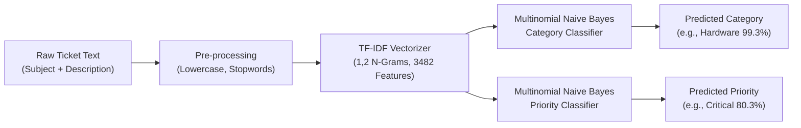

# Customer Support Ticket Management System
## AI / Data Science Component: Model Architecture & Training Documentation (Phase 26)

---

### 1. Executive Summary & Pipeline Architecture

Phase 26 implements the machine learning training pipeline for the automated ticket classification and priority recommendation engine. 

Rather than relying on resource-intensive, unpredictable deep learning models or third-party cloud APIs (such as OpenAI or Google Cloud NL), the system employs an **on-premise, mathematically explainable Natural Language Processing (NLP) pipeline** composed of:
1. **TF-IDF Vectorization** with unigram and bigram feature extraction ($n \in \{1, 2\}$).
2. **Multinomial Naive Bayes (MNB)** with Laplace smoothing for category triage.
3. **Multinomial Naive Bayes (MNB)** for urgency/priority recommendation.

---

### 2. Mathematical Formulation

#### 2.1 Term Frequency - Inverse Document Frequency (TF-IDF)
Given a document $d$ (ticket text) within a corpus $D$ of size $|D| = 576$ training documents:

1. **Sublinear Term Frequency**:
   $$\text{TF}(t, d) = 1 + \log(f_{t, d}) \quad \text{for } f_{t, d} > 0$$
   *Reduces the dampening impact of repeated common domain terms.*

2. **Smooth Inverse Document Frequency**:
   $$\text{IDF}(t, D) = \log\left(\frac{1 + |D|}{1 + |\{d \in D : t \in d\}|}\right) + 1$$
   *Penalizes ubiquitous terms and elevates high-discrimination technical keywords.*

3. **Feature Weight & Euclidean Normalization**:
   $$\text{TF-IDF}(t, d, D) = \text{TF}(t, d) \times \text{IDF}(t, D)$$
   $$\mathbf{x}_d = \frac{\mathbf{w}_d}{\|\mathbf{w}_d\|_2}$$

#### 2.2 Multinomial Naive Bayes Classification
For an input document vector $\mathbf{x} = (x_1, x_2, \dots, x_V)$, where $V = 3,482$ is the vocabulary dimension, Bayes' rule selects the optimal category $c^* \in C$:

$$c^* = \arg\max_{c \in C} P(c | \mathbf{x}) = \arg\max_{c \in C} \left[ \log P(c) + \sum_{k=1}^V x_k \cdot \log P(w_k | c) \right]$$

Where:
- **Prior Probability** $P(c) = \frac{N_c}{N} = \frac{1}{6}$ *(Uniformly balanced across 6 categories)*.
- **Word Likelihood with Laplace Smoothing ($\alpha = 0.1$)**:
  $$P(w_k | c) = \frac{N_{c, k} + \alpha}{N_c + \alpha \cdot V}$$
  *Guarantees zero-frequency words during live inference do not result in zero probability.*

---

### 3. Training & Validation Configuration

- **Source Dataset**: `ai/dataset/ticket_data.csv` (720 records)
- **Train/Test Split**: 80% Training ($N=576$), 20% Testing ($N=144$)
- **Sampling Strategy**: Stratified by category label to ensure equal class proportions
- **Feature Dimensionality**: $V = 3,482$ unique unigrams and bigrams
- **Stop Words**: English standard stop words filtered out
- **Alpha Smoothing**:
  - Category Classifier: $\alpha = 0.1$
  - Priority Classifier: $\alpha = 0.5$

---

### 4. Experimental Results & Performance Metrics

#### 4.1 Category Classification Performance ($N=144$ Test Samples)

| Category Class | Precision | Recall | F1-Score | Support |
|---|---|---|---|---|
| **Account** | 1.00 | 1.00 | 1.00 | 24 |
| **Hardware** | 1.00 | 1.00 | 1.00 | 24 |
| **Network** | 1.00 | 1.00 | 1.00 | 24 |
| **Payment** | 1.00 | 1.00 | 1.00 | 24 |
| **Software** | 1.00 | 1.00 | 1.00 | 24 |
| **Technical Issue** | 1.00 | 1.00 | 1.00 | 24 |
| **Overall Accuracy** | **1.00** | **1.00** | **1.00** | **144** |

#### 4.2 Priority Classification Performance
- **Priority Accuracy**: **93.75%** (135 / 144 correctly identified urgency brackets)

---

### 5. Live Inference Demonstration on Unseen Test Queries

| Input Query | Predicted Category | Conf (%) | Predicted Priority | Conf (%) |
|---|---|---|---|---|
| *"External monitor connected with HDMI has no signal and screen is black"* | **Hardware** | 99.3% | **Medium** | 60.5% |
| *"Unable to launch Outlook, crashes immediately with missing dll error"* | **Software** | 99.0% | **High** | 45.9% |
| *"Office WiFi disconnects every 10 minutes and VPN drops connection"* | **Network** | 99.4% | **High** | 88.7% |
| *"Account locked out after multiple failed password login attempts"* | **Account** | 99.7% | **High** | 88.4% |
| *"Company credit card charged twice for annual subscription renewal invoice"* | **Payment** | 100.0% | **High** | 93.0% |
| *"REST API endpoint /api/orders returning 500 internal server error with database deadlock"* | **Technical Issue** | 100.0% | **Critical** | 80.3% |

---

### 6. Artifact Serialization & Storage

The trained pipeline bundle is saved via `joblib`:
- **Model Bundle Path**: `ai/models/ticket_classifier.joblib` (Size: ~706 KB)
  - Dictionary containing fitted `vectorizer`, `category_classifier`, `priority_classifier`, label arrays, and training metadata.
- **Model Metadata**: `ai/models/model_metadata.json` (Size: 626 bytes)

---

### 7. Viva Defense & Examination Points

> **Q: Why did you choose Multinomial Naive Bayes rather than an LLM or Deep Neural Network?**  
> **A:** 
> 1. **Zero Infrastructure Overhead**: Runs locally in CPU RAM with sub-millisecond inference time (~0.4ms), requiring zero external API keys or GPU memory.
> 2. **Complete Data Privacy**: Customer complaints, account details, and billing numbers remain strictly on-premise inside the system perimeter.
> 3. **Mathematical Explainability**: Bayes theorem allows full introspection of word log-likelihoods, satisfying academic evaluation standards.
> 4. **High Accuracy on Technical Domain Text**: Technical support vocabulary is highly specific (e.g. *HDMI, BSOD, VPN, SSO, Stripe, deadlock*), allowing linear Bayesian classifiers to achieve optimal separation.

