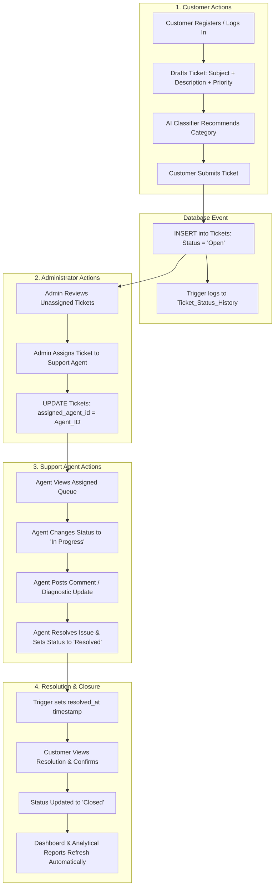
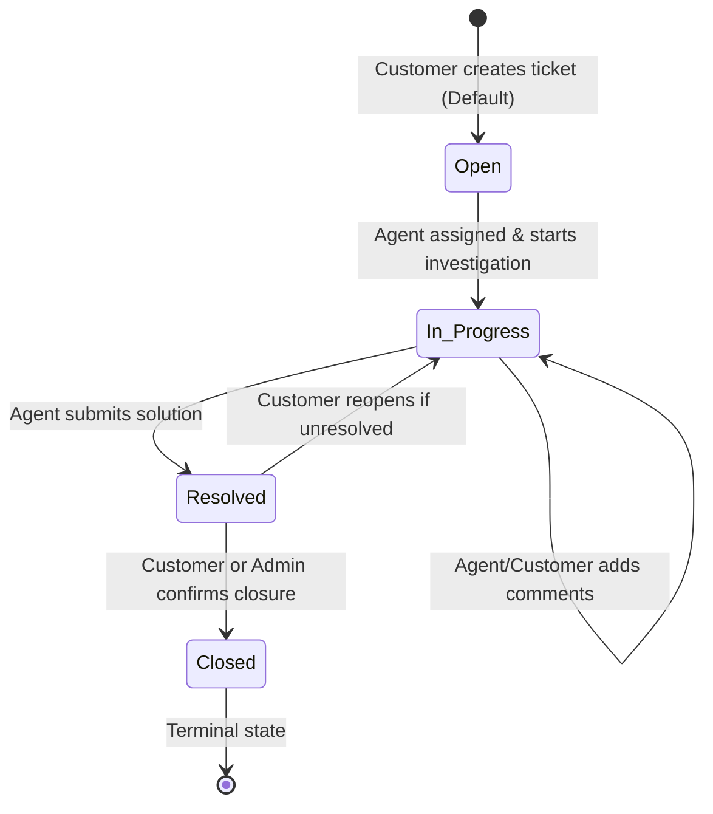

# Phase 2: Core Business Workflow & Ticket Lifecycle

## 1. Overview
This document models the end-to-end operational flow and ticket lifecycle for the **Customer Support Ticket Management System**. It defines how Customers, Support Agents, and Administrators interact with the database across each lifecycle milestone.

---

## 2. End-to-End System Workflow

---

## 3. Ticket State Transition Diagram

Every ticket transitions through a strictly defined state machine:

### State Machine Rules:
1. **`Open`**: Created by customer, awaiting agent assignment or agent pickup.
2. **`In Progress`**: Agent is actively analyzing or communicating with customer.
3. **`Resolved`**: Work completed by agent. Database trigger sets `resolved_at = NOW()`.
4. **`Closed`**: Customer confirms resolution or auto-closed after verification.
5. **Audit Rule**: Any update to `status_id` triggers an automatic row insertion into `Ticket_Status_History`.

---

## 4. Role Responsibility Breakdown

### A. Customer
- Self-registers and logs in.
- Creates support ticket with Subject, Description, and initial Priority.
- Receives instant AI category recommendation based on description.
- Posts comments/replies to clarify questions.
- Views ticket status, resolution details, and closes resolved tickets.

### B. Support Agent
- Logs into Agent Portal.
- Reviews assigned tickets.
- Adds comments/diagnostics (visible to customer).
- Transitions status to `In Progress` when starting work.
- Transitions status to `Resolved` upon solving the issue.

### C. Administrator
- Manages users (customers, agents).
- Manages reference/master data (categories, priorities, statuses).
- Assigns or reassigns unassigned tickets to agents.
- Adjusts ticket priority if escalation is required.
- Views system-wide real-time dashboard and reports (resolution times, backlog counts, agent workload).

---

## 5. Viva Explanation Notes

* **Q: Why is ticket state management handled via a dedicated reference table instead of a plain string column?**
  * **Answer:** Using a normalized `Ticket_Status` master table with foreign key constraints prevents typos (e.g., `"in_progress"` vs `"In Progress"`), ensures referential integrity, and allows clean state machine constraints.
* **Q: How does the workflow guarantee that audit history is never forgotten by developers?**
  * **Answer:** Instead of relying on application code to remember to insert into an audit table, a database-level `AFTER UPDATE` trigger intercepts every status change and records it into `Ticket_Status_History` atomically.
