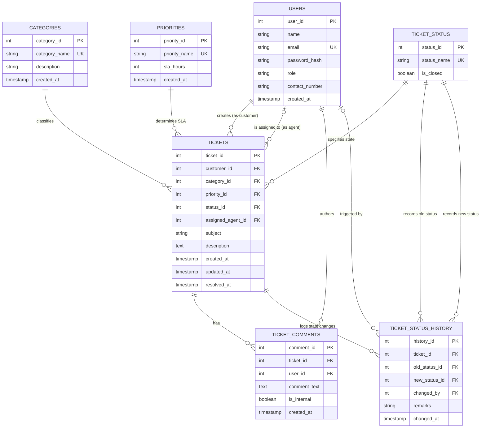

# Phase 4: Entity-Relationship (ER) Diagram & Cardinality Specifications

## 1. Overview
The Entity-Relationship (ER) diagram models the conceptual and logical schema for the **Customer Support Ticket Management System**. It visually represents all 7 entities, their primary keys (PK), foreign keys (FK), descriptive attributes, and the exact cardinality of their relationships using Crow's Foot notation.

---

## 2. Complete Entity-Relationship Diagram

---

## 3. Relationship & Cardinality Details

| Relationship | Entities Involved | Cardinality (Crow's Foot) | Participation | Business Rule Explanation |
|---|---|---|---|---|
| **Customer $\rightarrow$ Tickets** | `Users` to `Tickets` | **1 : N** (`||--o{`) | Mandatory on Ticket side, Optional on User side | A customer can submit 0, 1, or many tickets. Every ticket MUST belong to exactly 1 customer (`customer_id NOT NULL`). |
| **Agent $\rightarrow$ Tickets** | `Users` to `Tickets` | **0..1 : N** (`|o--o{`) | Optional on both sides | An agent can be assigned to 0, 1, or many tickets. A ticket can initially have 0 assigned agents (unassigned `NULL`), but at most 1 assigned agent at a time. |
| **Category $\rightarrow$ Tickets** | `Categories` to `Tickets` | **1 : N** (`||--o{`) | Mandatory on Ticket side | A category classifies 0, 1, or many tickets. Every ticket MUST belong to exactly 1 category (`category_id NOT NULL`). |
| **Priority $\rightarrow$ Tickets** | `Priorities` to `Tickets` | **1 : N** (`||--o{`) | Mandatory on Ticket side | A priority tier applies to 0, 1, or many tickets. Every ticket MUST belong to exactly 1 priority level. |
| **Status $\rightarrow$ Tickets** | `Ticket_Status` to `Tickets` | **1 : N** (`||--o{`) | Mandatory on Ticket side | A status applies to 0, 1, or many tickets. Every ticket has exactly 1 current status (`status_id NOT NULL`). |
| **Ticket $\rightarrow$ Comments** | `Tickets` to `Ticket_Comments`| **1 : N** (`||--o{`) | Optional on Ticket side, Mandatory on Comment side | A ticket can have 0, 1, or many comments. Every comment MUST be tied to exactly 1 ticket (`ticket_id NOT NULL`). |
| **User $\rightarrow$ Comments** | `Users` to `Ticket_Comments` | **1 : N** (`||--o{`) | Optional on User side, Mandatory on Comment side | A user can author 0 or many comments. Every comment MUST have an author (`user_id NOT NULL`). |
| **Ticket $\rightarrow$ History** | `Tickets` to `Ticket_Status_History` | **1 : N** (`||--o{`) | Optional on Ticket side, Mandatory on History side | A ticket accumulates 1 or many status history rows over its lifetime. Every history row belongs to 1 ticket. |

---

## 4. Key Structural Highlights for DBMS Examination

1. **Role Separation via Recursive Relationship Pattern**: Rather than creating duplicate tables for `Customers` and `Agents`, both role types are unified in `Users`. The `Tickets` table has two distinct foreign keys pointing back to `Users`:
   - `customer_id` (mandatory, creator of ticket)
   - `assigned_agent_id` (optional, agent resolving ticket)
2. **Double Reference to Status Master**: `Ticket_Status_History` maintains two foreign keys pointing to `Ticket_Status`:
   - `old_status_id`: State before transition (NULL upon initial creation)
   - `new_status_id`: State after transition (NOT NULL)
3. **Cascading Semantics**:
   - `Tickets` $\rightarrow$ `Ticket_Comments` uses `ON DELETE CASCADE`.
   - `Tickets` $\rightarrow$ `Ticket_Status_History` uses `ON DELETE CASCADE`.
   - `Users` $\rightarrow$ `Tickets` uses `ON DELETE RESTRICT` to protect audit trail integrity.

---

## 5. Viva Defense Q&A

* **Q: What is Cardinality and Modality in this ER diagram?**
  * **Answer:** Cardinality defines the maximum number of entity instances in the relationship (e.g., one user can create *many* tickets). Modality (or participation) defines the minimum number (e.g., a ticket *must* have at least 1 customer, making participation mandatory; an agent assignment can be 0 or 1, making participation optional).
* **Q: Why are there two separate foreign keys pointing from `Tickets` to `Users`?**
  * **Answer:** Because each foreign key represents a distinct semantic relationship with different cardinality and business rules: `customer_id` represents the ticket requester (mandatory), while `assigned_agent_id` represents the staff member tasked with resolution (optional, nullable initially).
