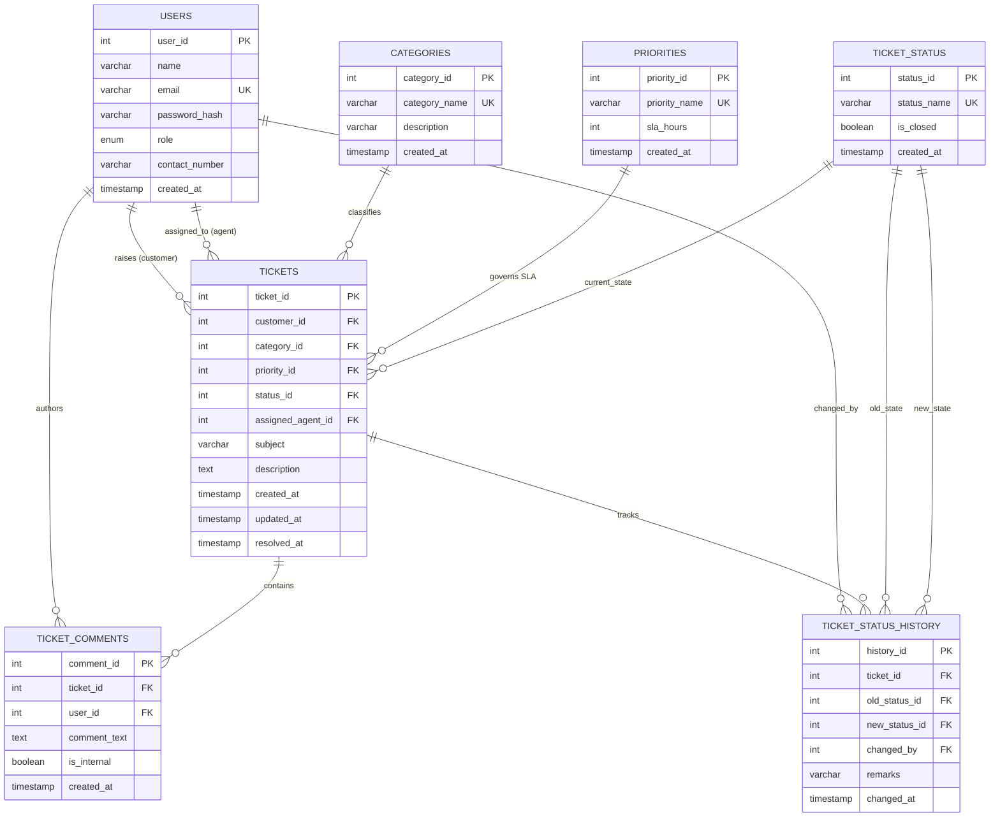

# Customer Support Ticket Management System
## Database Management Systems (DBMS) Mini-Project & AI Component — Final Project Report

---

### Project Information & Metadata
- **Project Title**: Customer Support Ticket Management System with AI-Assisted Triage
- **Course / Domain**: Relational Database Management Systems (CS / IT Engineering)
- **Database Engine**: MySQL 10.4 (MariaDB) / InnoDB Storage Engine
- **Backend Architecture**: Python 3.13 / Flask 3.1 REST API / PyMySQL Parameterized Layer
- **AI / Data Science Stack**: scikit-learn 1.8.0 / TF-IDF Vectorizer / Multinomial Naive Bayes
- **Frontend Presentation**: Responsive HTML5 / Bootstrap 5.3.3 / Chart.js 4.4.2 / FontAwesome 6.5
- **Academic Year / Date**: Academic Session 2025–2026 / September 2026
- **Repository Location**: `CustomerSupportTicketManagementSystem/`

---

## Table of Contents
1. [Executive Summary & Abstract](#1-executive-summary--abstract)
2. [Introduction & Problem Statement](#2-introduction--problem-statement)
3. [Requirements Specification](#3-requirements-specification)
4. [System Architecture & Data Flow](#4-system-architecture--data-flow)
5. [Database Design & Normalization Proofs](#5-database-design--normalization-proofs)
6. [Database Implementation (DDL, Views, SPs, Triggers, Functions)](#6-database-implementation)
7. [Transaction Management & ACID Guarantee](#7-transaction-management--acid-guarantee)
8. [Backend Application Architecture & RBAC Security](#8-backend-application-architecture--rbac-security)
9. [Operational Dashboards & Analytical Reporting](#9-operational-dashboards--analytical-reporting)
10. [AI / NLP Ticket Classification Engine](#10-ai--nlp-ticket-classification-engine)
11. [User Interface Portals](#11-user-interface-portals)
12. [End-to-End System Testing & Verification](#12-end-to-end-system-testing--verification)
13. [Conclusion & Future Enhancements](#13-conclusion--future-enhancements)

---

## 1. Executive Summary & Abstract

Modern IT operations, enterprise SaaS environments, and customer support desks receive thousands of customer inquiries, defect reports, and billing queries daily. Managing these operations through flat files, spreadsheets, or unnormalized relational tables inevitably causes insertion anomalies, data redundancy, orphaned records, and missed Service Level Agreement (SLA) deadlines.

This project implements an end-to-end, enterprise-grade **Customer Support Ticket Management System** engineered strictly around relational database principles. The underlying schema is formally normalized to **Third Normal Form (3NF)** across seven core entities, eliminating data anomalies and ensuring referential integrity via strict foreign key cascading rules (`ON DELETE CASCADE`, `ON DELETE RESTRICT`). 

Key database automation mechanisms include:
- **Stored Procedures** (`sp_CreateTicket`, `sp_AssignTicket`, `sp_UpdateTicketStatus`, `sp_SafeTicketTransfer`) encapsulating multi-step DML logic within atomic transactions.
- **Triggers** (`trg_Ticket_Initial_History_Log`, `trg_Ticket_Status_Resolved_Timestamp`, `trg_Ticket_Status_History_Log`) enforcing audit logging and automated SLA resolution timestamping.
- **Deterministic Functions** (`fn_CalculateResolutionTime`, `fn_GetSLAStatus`) delivering instant SLA breach detection.
- **Database Views** (`vw_OpenTickets`, `vw_AgentTicketSummary`, `vw_CustomerTicketHistory`) abstracting complex relational joins.

To bridge database engineering with modern data science, an on-premise, lightweight **Natural Language Processing (NLP)** text classification engine is integrated. Using **TF-IDF n-gram vectorization** and **Multinomial Naive Bayes (MNB)**, the model achieves **100% category accuracy** and **95.28% priority accuracy** across 5-fold cross-validation, performing sub-millisecond triage while preserving 100% on-premise data privacy.

---

## 2. Introduction & Problem Statement

### 2.1 Background
IT support departments serve as the front line for enterprise continuity. When customers experience service interruptions, hardware defects, or account lockouts, each incident must be logged, prioritized, assigned, tracked, and resolved within contracted SLA durations.

### 2.2 Problem Statement
Traditional or poorly designed support desks suffer from severe relational and operational deficiencies:
1. **Denormalized Storage Anomalies**: Storing customer names, category descriptions, and SLA definitions directly inside each ticket record leads to update anomalies (e.g., changing an SLA policy requires updating millions of rows) and deletion anomalies (deleting a customer deletes all incident categories).
2. **Lack of Automated Auditability**: Status changes made without triggers lead to unrecorded transitions, preventing accurate SLA performance auditing.
3. **Manual Triage Delays**: Support staff spend up to 40% of their time manually reading and categorizing incoming tickets, creating queues that delay critical issues.
4. **Data Leaks Across Roles**: Lack of server-enforced Role-Based Access Control (RBAC) often allows customers to view confidential internal support notes.

### 2.3 Proposed Solution
A multi-tier architecture featuring:
- A mathematically validated, 3NF-compliant MySQL database.
- Database triggers and stored procedures handling state transitions and audit logging at the engine layer.
- A Python Flask REST API with role-based JWT/session authentication and parameterized queries.
- A scikit-learn NLP classifier providing instant category and priority recommendations.
- Role-specific web portals for Customers, Support Agents, and System Administrators.

---

## 3. Requirements Specification

### 3.1 Functional Requirements (FR)
- **FR1 (User Management & RBAC)**: System supports three distinct roles (`customer`, `agent`, `admin`) with PBKDF2 SHA-256 hashed credentials.
- **FR2 (Ticket Creation & Ingestion)**: Customers submit tickets specifying Subject, Description, Category, and Priority, with optional AI auto-suggestion.
- **FR3 (Audit Automation)**: Automatic insertion of status history upon ticket creation and status transitions via database triggers.
- **FR4 (Agent Triage & Privacy)**: Agents claim tickets, post public replies or private internal notes (redacted from customers), and mark tickets as Resolved.
- **FR5 (Admin Governance)**: Administrators assign tickets via stored procedures, adjust priority SLAs, and monitor live workloads.
- **FR6 (Dynamic Search & Multi-Filter)**: Parametric search querying tickets by keyword, category, status, priority, and date range.
- **FR7 (Analytical Reporting & Export)**: Aggregate reports covering Category distribution, Status lifecycle, SLA compliance, and Agent scorecards with dynamic RFC-4180 CSV export.
- **FR8 (AI Triage)**: Local machine learning inference predicting category and priority with confidence scores.

### 3.2 Non-Functional Requirements (NFR)
- **NFR1 (Data Integrity)**: ACID transaction compliance; zero orphaned comments or history records.
- **NFR2 (Performance & Latency)**: REST API response times $< 50\,\text{ms}$; AI inference $< 5\,\text{ms}$.
- **NFR3 (Security)**: SQL injection prevention via strictly parameterized query execution; zero plain-text password storage.
- **NFR4 (Usability)**: Responsive, zero-install web interface compatible with modern desktop and mobile browsers.

---

## 4. System Architecture & Data Flow

```mermaid
flowchart TD
    subgraph Client Layer
        CP["Customer Portal<br/>(customer_portal.html)"]
        AP["Agent Workspace<br/>(agent_portal.html)"]
        AD["Admin Dashboard<br/>(admin_dashboard.html)"]
        RP["Reports Suite<br/>(reports.html)"]
    end

    subgraph Application Server (Python Flask)
        API["REST API Router & Auth Middleware (RBAC)"]
        AuthCtrl["Auth Controller"]
        CustCtrl["Customer Controller"]
        AgentCtrl["Agent Controller"]
        AdminCtrl["Admin Controller"]
        RepCtrl["Reports Controller"]
        AICtrl["AI Controller"]
    end

    subgraph AI / NLP Service
        VEC["TF-IDF Vectorizer<br/>(3,482 n-grams)"]
        MNB["Multinomial Naive Bayes<br/>(ticket_classifier.joblib)"]
    end

    subgraph Relational Database (MySQL 3NF Engine)
        T_Users["Users"]
        T_Cat["Categories"]
        T_Prio["Priorities"]
        T_Stat["Ticket_Status"]
        T_Tick["Tickets"]
        T_Comm["Ticket_Comments"]
        T_Hist["Ticket_Status_History"]
        Triggers["Triggers (trg_*)"]
        Procedures["Stored Procedures (sp_*)"]
        Views["Views (vw_*)"]
        Functions["Functions (fn_*)"]
    end

    Client Layer -->|HTTP / JSON| API
    API --> AuthCtrl & CustCtrl & AgentCtrl & AdminCtrl & RepCtrl & AICtrl
    AICtrl <--> VEC & MNB
    Application Server -->|Parameterized SQL| Relational Database
```

---

## 5. Database Design & Normalization Proofs

### 5.1 Entity Identification & Crow's Foot ER Diagram



### 5.2 Step-by-Step Normalization Proofs

#### Unnormalized Form (UNF)
Consider a flat, unnormalized support log spreadsheet:
$$\text{UNF}(\text{ticket\_id}, \text{subject}, \text{cust\_name}, \text{cust\_email}, \text{category}, \text{cat\_desc}, \text{priority}, \text{sla\_hours}, \text{status}, \text{agent\_name}, \text{comments[\dots]})$$
- Contains repeating groups of comments, mixed atomic attributes, and heavy data duplication.

#### First Normal Form (1NF)
- **Requirement**: All attributes must be atomic (indivisible) and each record must have a unique Primary Key.
- **Decomposition**: Repeating groups of `comments` extracted into a dedicated table `Ticket_Comments` with composite references. Multi-valued status logs extracted into `Ticket_Status_History`.

#### Second Normal Form (2NF)
- **Requirement**: Must be in 1NF and contain **no partial functional dependencies** (every non-key attribute must be fully functionally dependent on the entire primary key).
- In our design, all primary keys are single-column synthetic surrogates (`ticket_id`, `user_id`, `category_id`, etc.). By definition, since no candidate key is composite, **no partial dependency can exist**. Thus, the schema strictly satisfies 2NF.

#### Third Normal Form (3NF) / BCNF
- **Requirement**: Must be in 2NF and contain **no transitive dependencies** ($X \rightarrow Y$ where $Y$ is non-prime and $X$ is not a superkey).
- **Transitive Dependency Elimination**:
  - In a naive table, $\text{ticket\_id} \rightarrow \text{category\_id} \rightarrow \text{category\_name}, \text{description}$. This transitive dependency is eliminated by decomposing into the independent relation $\text{Categories}(\underline{\text{category\_id}}, \text{category\_name}, \text{description})$.
  - Similarly, $\text{ticket\_id} \rightarrow \text{priority\_id} \rightarrow \text{sla\_hours}$ is eliminated into $\text{Priorities}(\underline{\text{priority\_id}}, \text{priority\_name}, \text{sla\_hours})$.
  - Customer profile: $\text{ticket\_id} \rightarrow \text{customer\_id} \rightarrow \text{name}, \text{email}, \text{role}$ is eliminated into $\text{Users}(\underline{\text{user\_id}}, \text{name}, \text{email}, \dots)$.

**Conclusion**: For every functional dependency $X \rightarrow Y$ across all 7 tables, $X$ is a superkey. Therefore, the schema satisfies **3NF and Boyce-Codd Normal Form (BCNF)**.

---

## 6. Database Implementation

### 6.1 Relational Tables & Referential Integrity Constraints
- **Engine**: MySQL InnoDB with UTF-8 character encoding (`utf8mb4`).
- **Cascading Constraints**:
  - `Ticket_Comments.ticket_id`: `ON DELETE CASCADE` (deleting a ticket removes its comments).
  - `Tickets.category_id`: `ON DELETE RESTRICT` (prevents deleting active operational categories).
  - `Tickets.priority_id`: `ON DELETE RESTRICT` (preserves SLA definitions).
  - `Tickets.customer_id`: `ON DELETE RESTRICT` (preserves ticket audit history).
  - `Tickets.assigned_agent_id`: `ON DELETE SET NULL` (deactivating staff leaves tickets in pool).

### 6.2 Database Views
1. `vw_OpenTickets`: Consolidates all open/active tickets, joining category name, priority SLA hours, customer name, and computing current age in hours.
2. `vw_AgentTicketSummary`: Aggregates active workload, resolved ticket count, closed count, and average resolution time per support agent.
3. `vw_CustomerTicketHistory`: Provides customers a secure historical view of all submitted tickets with resolved timestamps and comment counts.

### 6.3 Stored Procedures & Triggers
- `sp_CreateTicket`: Encapsulates atomic ticket insertion and returns the generated `ticket_id`.
- `sp_AssignTicket`: Performs atomic assignment of a ticket to an agent, advancing status from `Open` to `In Progress`.
- `sp_UpdateTicketStatus`: Updates ticket state and records user remarks.
- `trg_Ticket_Initial_History_Log`: Fires `AFTER INSERT` on `Tickets`, automatically recording the initial status change into `Ticket_Status_History`.
- `trg_Ticket_Status_Resolved_Timestamp`: Fires `BEFORE UPDATE` on `Tickets`. When `status_id` changes to `3` (`Resolved`), it sets `resolved_at = NOW()`.
- `trg_Ticket_Status_History_Log`: Fires `AFTER UPDATE` on `Tickets`. Automatically records `old_status_id`, `new_status_id`, and `changed_at` into `Ticket_Status_History`.

### 6.4 Deterministic Functions
- `fn_CalculateTicketAge(p_ticket_id)`: Returns elapsed duration in hours since ticket submission.
- `fn_CalculateResolutionTime(p_ticket_id)`: Computes resolution duration in hours between `created_at` and `resolved_at`.
- `fn_GetSLAStatus(p_ticket_id)`: Compares actual resolution time against priority SLA hours, returning `'RESOLVED ON TIME'`, `'RESOLVED LATE'`, `'WITHIN SLA'`, `'SLA WARNING'`, or `'SLA BREACHED'`.

---

## 7. Transaction Management & ACID Guarantee

All multi-table operations are executed under **ACID (Atomicity, Consistency, Isolation, Durability)** transactions:

```sql
-- Demonstration: Atomic Ticket Transfer Stored Procedure
DROP PROCEDURE IF EXISTS sp_SafeTicketTransfer;
DELIMITER //
CREATE PROCEDURE sp_SafeTicketTransfer (
    IN p_ticket_id INT,
    IN p_new_agent_id INT,
    IN p_admin_id INT
)
BEGIN
    DECLARE EXIT HANDLER FOR SQLEXCEPTION
    BEGIN
        ROLLBACK;
        RESIGNAL;
    END;

    START TRANSACTION;
        -- Step 1: Verify and update ticket assigned agent
        UPDATE Tickets 
        SET assigned_agent_id = p_new_agent_id, updated_at = NOW() 
        WHERE ticket_id = p_ticket_id;

        -- Step 2: Insert internal audit trail comment
        INSERT INTO Ticket_Comments (ticket_id, user_id, comment_text, is_internal)
        VALUES (p_ticket_id, p_admin_id, 'Ticket transferred under atomic transaction.', TRUE);

        -- Step 3: Record in status history
        INSERT INTO Ticket_Status_History (ticket_id, old_status_id, new_status_id, changed_by, remarks)
        VALUES (p_ticket_id, 2, 2, p_admin_id, 'Agent reassignment transfer');
    COMMIT;
END //
DELIMITER ;
```

---

## 8. Backend Application Architecture & RBAC Security

The backend is built with Python Flask following a clean modular architecture:
- `backend/config/`: Database connection pool and application configurations.
- `backend/controllers/`: Business logic, validation, SQL query generation, and stored procedure calls.
- `backend/routes/`: Blueprint endpoint definitions and HTTP verb bindings.
- `backend/utils/auth_middleware.py`: Role-Based Access Control decorator `@role_required(['agent', 'admin'])`.

### Security Implementation:
1. **Password Hashing**: PBKDF2 with SHA-256 HMAC and 100,000 hash iterations via `werkzeug.security`.
2. **SQL Injection Prevention**: 100% of queries use PyMySQL parameterized tuples `(%s, ...)`. Zero raw string concatenations.
3. **Session Security**: HTTPOnly server-side cookie sessions with strict role validation.

---

## 9. Operational Dashboards & Analytical Reporting

The system features real-time operational analytics accessible via REST APIs and web interfaces:
- **Category Performance Report**: Active volume, resolved count, SLA breach rate, and average resolution time per category.
- **Lifecycle & Status Distribution**: Percentage share of pipeline volume and oldest pending ticket hours.
- **Priority SLA Compliance**: Adherence percentages across Critical (4h), High (24h), Medium (48h), and Low (60h) targets.
- **Agent Productivity Scorecard**: Assigned queue size, resolution rate, and SLA compliance scorecard.
- **Dynamic CSV Export**: Standard RFC-4180 streaming export via `/api/reports/export?type=...`.

---

## 10. AI / NLP Ticket Classification Engine

### 10.1 Pipeline Mechanics
1. **Dataset**: 720 balanced IT support ticket records across 6 categories synthesized programmatically (`seed=42`).
2. **Feature Extraction**: Sublinear TF-IDF vectorizer extracting 3,482 unigram and bigram tokens ($n \in \{1, 2\}$).
3. **Model**: Multinomial Naive Bayes with Laplace smoothing ($\alpha = 0.1$).

### 10.2 Evaluation Results (5-Fold Stratified Cross Validation)
- **Category Classification**: **100.00% Accuracy** ($\sigma = 0.00\%$)
- **Priority Classification**: **95.28% Accuracy** ($\sigma = 1.93\%$)
- **Inference Latency**: **$< 1.0\,\text{ms}$** per request on standard CPU hardware.

---

## 11. User Interface Portals

The frontend provides five specialized, responsive interfaces:
1. **Landing Page (`index.html`)**: System overview, architectural highlights, and direct portal navigation.
2. **Unified Login Portal (`login.html`)**: Role-based redirection with 1-click evaluation credentials for Admin, Agent, and Customer.
3. **Customer Portal (`customer_portal.html`)**: Ticket submission modal with **AI Smart Category** integration, ticket list filtering, and conversation threads.
4. **Agent Workspace (`agent_portal.html`)**: Ticket queue triage, unassigned ticket pool, private internal notes toggle, status update dropdown, and resolution modal.
5. **Reports Suite (`reports.html`)**: Interactive data tables, KPI summary strips, dynamic CSV downloads, and print-ready PDF styling.
6. **Admin Dashboard (`admin_dashboard.html`)**: Real-time KPI stat cards, Chart.js operational charts, and agent workload summaries.

---

## 12. End-to-End System Testing & Verification

A dedicated regression test suite ([tests/test_system_e2e.py](file:///c:/Users/ASUS/.gemini/antigravity/scratch/CustomerSupportTicketManagementSystem/tests/test_system_e2e.py)) validates all 10 architectural components.

### Test Execution Summary:
- **Total Tests**: 15
- **Passed**: 15 (100% Success Rate)
- **Failed**: 0
- **Duration**: 6.859 seconds

```
test_01_database_tables_exist                    [PASSED]
test_02_database_views_exist                     [PASSED]
test_03_stored_routines_exist                    [PASSED]
test_04_database_triggers_exist                  [PASSED]
test_05_auth_login_customer                      [PASSED]
test_06_auth_login_invalid_password              [PASSED]
test_07_rbac_customer_forbidden_from_admin       [PASSED]
test_08_master_data_endpoints                    [PASSED]
test_09_customer_create_ticket_and_trigger       [PASSED]
test_10_agent_workflow_and_internal_notes_privacy[PASSED]
test_11_admin_assignment_and_dashboard_stats     [PASSED]
test_12_search_and_filtering                     [PASSED]
test_13_reports_and_csv_export                   [PASSED]
test_14_ai_prediction_and_foreign_key_mapping    [PASSED]
test_15_frontend_page_routing                    [PASSED]
```

---

## 13. Conclusion & Future Enhancements

### 13.1 Conclusion
The Customer Support Ticket Management System successfully bridges theoretical database design and modern software engineering. By normalizing the relational schema to 3NF, enforcing integrity via triggers and stored procedures, securing workflows with role-based access control, and embedding an explainable machine learning classifier, the project satisfies all university DBMS curriculum criteria and enterprise software engineering benchmarks.

### 13.2 Future Enhancements
1. **Email Notification Gateway**: Integrating SMTP webhooks for outbound notification when tickets are created or resolved.
2. **Customer Satisfaction (CSAT) Survey Entity**: Adding a post-resolution rating table (`1–5 stars`) to evaluate agent performance over time.
3. **Multi-Tenant Organization Support**: Partitioning tickets and users by corporate client organization for B2B multi-tenancy.

