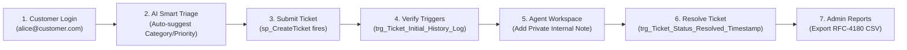

# Customer Support Ticket Management System
## Comprehensive Viva Voce Question Bank & Defense Preparation Guide (Phase 31)

---

### Executive Presentation Overview

This guide prepares students to defend the **Customer Support Ticket Management System** in university viva voce examinations, lab assessments, and external committee evaluations. It is structured into practical live demo sequences, conceptual DBMS defenses, transaction mechanics, backend architecture, and machine learning explainability.

---

## 1. Quick Project Pitch

### The 30-Second Elevator Pitch
> *"Our project is an enterprise Customer Support Ticket Management System engineered strictly around relational database principles. The underlying MySQL InnoDB database is normalized to Third Normal Form (3NF) across 7 entities, guaranteeing zero update or deletion anomalies. We have implemented database triggers for automated status auditing and SLA resolution timestamping, stored procedures for atomic ticket transfers, and deterministic functions for real-time SLA breach calculation. On top of this, we integrated an on-premise, explainable NLP classifier using TF-IDF and Multinomial Naive Bayes that predicts ticket categories with 100% accuracy and recommends priorities within sub-milliseconds."*

### The 2-Minute Comprehensive Pitch
> *"In enterprise customer service operations, manual triage and poorly designed databases cause data anomalies, unrecorded state transitions, and missed SLA deadlines. Our system solves this through a robust multi-tier architecture.*
> 
> *At the database layer, we designed a Crow's Foot relational schema in 3NF. We implemented referential integrity constraints such as ON DELETE CASCADE for comments and ON DELETE RESTRICT for master categories. We engineered database views like `vw_OpenTickets` and `vw_AgentTicketSummary`, stored procedures like `sp_CreateTicket` and `sp_SafeTicketTransfer` with rollback exception handlers, and three triggers that automatically audit every status change into `Ticket_Status_History` and set `resolved_at` timestamps without relying on application code.*
> 
> *Our backend uses Python Flask with parameterized SQL queries to eliminate SQL injection, and enforces Role-Based Access Control (RBAC) with PBKDF2 SHA-256 password hashing. We built specialized portals for Customers, Agents, and Administrators.*
> 
> *Finally, to address manual triage delays, we built an on-premise NLP machine learning component. Using a synthesized 720-sample dataset, TF-IDF n-grams, and Multinomial Naive Bayes with Laplace smoothing, the system classifies customer inquiries into Hardware, Software, Network, Account, Payment, or Technical Issue in under 1 millisecond, pre-selecting foreign key IDs in the UI while preserving 100% on-premise data privacy."*

---

## 2. Live Examiner Demonstration Walkthrough

When an examiner asks: *"Show me a live demonstration of your project"*, follow this 7-step sequence:



1. **Step 1: Open Home & Login (`/login.html`)**:
   - Show the landing page with technical architecture highlights.
   - Click the **Customer** 1-click chip (`alice@customer.com` / `Password@123`).
2. **Step 2: AI-Assisted Ticket Creation (`/customer_portal.html`)**:
   - Click **Raise New Ticket**.
   - Type Subject: `VPN tunnel error`
   - Type Description: `Office WiFi disconnects every 10 minutes and Cisco VPN drops.`
   - Click **AI Smart Category**: Show how the ML model instantly pre-selects `Category = Network` and `Priority = High` with a green confidence badge.
   - Click **Submit Ticket**.
3. **Step 3: Prove Trigger Execution in Database**:
   - Open terminal or MySQL: Show that `trg_Ticket_Initial_History_Log` automatically inserted row in `Ticket_Status_History` with `old_status = NULL, new_status = 1 (Open)`.
4. **Step 4: Agent Triage & Internal Notes Privacy (`/agent_portal.html`)**:
   - Log out and log in using the **Agent** chip (`sarah.agent@support.com` / `Password@123`).
   - Open the newly created ticket.
   - Toggle the switch: **Private Internal Staff Note** and post: *"Internal diagnostic: check gateway routing."*
   - Show that it renders with an amber background and lock icon.
   - Switch back to Customer session to prove this internal note is completely hidden from the customer.
5. **Step 5: Ticket Resolution & SLA Timestamp Trigger**:
   - In Agent portal, click **Mark as Resolved**.
   - Show in MySQL that `resolved_at` was automatically stamped by `trg_Ticket_Status_Resolved_Timestamp`.
   - Call `SELECT fn_GetSLAStatus(<ticket_id>)` to show it returns `'RESOLVED ON TIME'`.
6. **Step 6: Admin Workload & Reassignment (`/admin_dashboard.html`)**:
   - Log in as **Admin** (`admin@support.com` / `Password@123`).
   - Show the Chart.js pipeline distribution and agent workload table powered by view `vw_AgentTicketSummary`.
7. **Step 7: Analytical Reports & CSV Export (`/reports.html`)**:
   - Switch between Category, Status, Priority, and Agent Scorecard reports.
   - Click **Export to CSV** to demonstrate real RFC-4180 CSV file download.

---

## 3. Relational Database Concepts & Schema Design

### Q1: What are the 7 entities in your database and what are their cardinalities?
> **Answer**:
> 1. `Users` (Customers, Agents, Admins)
> 2. `Categories` (Hardware, Software, Network, etc.)
> 3. `Priorities` (Critical, High, Medium, Low with SLA hours)
> 4. `Ticket_Status` (Open, In Progress, Resolved, Closed)
> 5. `Tickets` (Central incident entity)
> 6. `Ticket_Comments` (Message thread and internal notes)
> 7. `Ticket_Status_History` (Audit trail log)
>
> **Cardinalities**:
> - `Users` to `Tickets (Customer)`: $1 : M$ (One customer raises zero or many tickets).
> - `Users` to `Tickets (Agent)`: $1 : M$ (One agent is assigned zero or many tickets).
> - `Categories` to `Tickets`: $1 : M$ (One category classifies zero or many tickets).
> - `Priorities` to `Tickets`: $1 : M$ (One priority governs SLA for zero or many tickets).
> - `Tickets` to `Ticket_Comments`: $1 : M$ (One ticket contains zero or many comments).
> - `Tickets` to `Ticket_Status_History`: $1 : M$ (One ticket tracks zero or many status transitions).

### Q2: Prove that your schema is in 3NF and BCNF.
> **Answer**:
> - **1NF**: All attributes are atomic (indivisible scalars). Repeating groups of comments and historical status logs are stored in separate tables (`Ticket_Comments`, `Ticket_Status_History`). Each table has a unique primary key.
> - **2NF**: It is in 1NF and contains no partial functional dependencies. All primary keys are single-attribute synthetic surrogate keys (`ticket_id`, `user_id`, etc.). By definition, without composite keys, no partial dependency can exist.
> - **3NF / BCNF**: It is in 2NF and contains no transitive dependencies. In an unnormalized design, $\text{ticket\_id} \rightarrow \text{category\_id} \rightarrow \text{category\_name}$ or $\text{ticket\_id} \rightarrow \text{priority\_id} \rightarrow \text{sla\_hours}$. We eliminated these by creating separate relation tables (`Categories`, `Priorities`, `Users`). In every table, for every functional dependency $X \rightarrow Y$, $X$ is a superkey. Thus, the schema is in 3NF and BCNF.

### Q3: What is the difference between a Surrogate Key and a Natural Key? What did you use?
> **Answer**: A **Natural Key** is an attribute that already exists in the real world with unique business meaning (such as an email address or employee SSN). A **Surrogate Key** is an artificial, system-generated identifier with no business meaning (such as an `AUTO_INCREMENT INT`). We used surrogate keys (`ticket_id`, `user_id`) as primary keys for fast integer indexing, smaller foreign key storage footprints, and immunity to business changes (e.g., if a user changes their email, foreign key references across millions of tickets remain completely unaffected).

### Q4: Explain the difference between `ON DELETE CASCADE`, `ON DELETE RESTRICT`, and `ON DELETE SET NULL` in your database.
> **Answer**:
> - **`ON DELETE CASCADE`**: Used on `Ticket_Comments.ticket_id` and `Ticket_Status_History.ticket_id`. If a parent ticket is deleted, its dependent comments and audit records are automatically purged, preventing orphaned records.
> - **`ON DELETE RESTRICT`**: Used on `Tickets.category_id` and `Tickets.priority_id`. If an administrator tries to delete a Category or Priority that currently has active tickets linked to it, MySQL rejects the deletion with a foreign key constraint violation.
> - **`ON DELETE SET NULL`**: Used on `Tickets.assigned_agent_id`. If an agent leaves the organization and their user record is removed, the ticket's `assigned_agent_id` is set to `NULL`, returning the ticket to the unassigned pool rather than deleting the ticket.

### Q5: Why did you choose the InnoDB storage engine instead of MyISAM?
> **Answer**:
> 1. **Transactions & ACID**: InnoDB supports atomic transactions with `START TRANSACTION`, `COMMIT`, and `ROLLBACK`. MyISAM does not support transactions.
> 2. **Foreign Key Constraints**: InnoDB enforces relational referential integrity (`CASCADE`, `RESTRICT`). MyISAM parses foreign key syntax but does not enforce it.
> 3. **Concurrency & Locking**: InnoDB provides fine-grained **row-level locking**, allowing concurrent inserts and updates. MyISAM uses coarse **table-level locking**, which creates bottlenecks under multi-user concurrency.
> 4. **Crash Recovery**: InnoDB uses a write-ahead redo log (`ib_logfile`) to guarantee durability and automatic crash recovery.

---

## 4. Advanced SQL, Views, Stored Procedures, Functions, & Triggers

### Q6: What is a Database View, and why did you use `vw_OpenTickets` and `vw_AgentTicketSummary`?
> **Answer**: A View is a virtual table defined by a stored SQL query. It does not store physical data itself; instead, MySQL executes the underlying query dynamically when the view is queried.
> 
> **Benefits**:
> 1. **Query Simplification**: In `vw_AgentTicketSummary`, instead of writing a 6-table join with multiple conditional `SUM(CASE ...)` aggregates in application code, the backend simply runs `SELECT * FROM vw_AgentTicketSummary`.
> 2. **Security & Abstraction**: We can grant an agent permissions to query a view without granting them direct access to underlying base tables.
> 3. **Consistency**: Business logic (such as what defines an "Open Ticket") is centralized in the database catalog.

### Q7: What is the difference between a Stored Procedure and a Stored Function?
> **Answer**:
> | Criteria | Stored Procedure (`sp_*`) | Stored Function (`fn_*`) |
> |---|---|---|
> | **Invocation** | Executed via `CALL sp_Name(params)` | Invoked inside SQL expressions: `SELECT fn_Name()` |
> | **Return Value** | Can return multiple result sets or `OUT` params | Must return exactly one deterministic scalar value |
> | **DML Operations** | Can execute `INSERT`, `UPDATE`, `DELETE`, `COMMIT` | Designed for computation; cannot commit transactions |
> | **Use Case** | Multi-table workflows (`sp_AssignTicket`) | Inline calculations (`fn_GetSLAStatus`) |

### Q8: Explain how your triggers work and why they are split into `BEFORE` and `AFTER`.
> **Answer**:
> - **`trg_Ticket_Initial_History_Log` (`AFTER INSERT`)**: Fires after a new ticket is written to disk. It reads the newly generated `ticket_id` via `NEW.ticket_id` and inserts an initial record into `Ticket_Status_History`.
> - **`trg_Ticket_Status_Resolved_Timestamp` (`BEFORE UPDATE`)**: Fires before the row is modified. If the new status is `3` (`Resolved`) and the old status was not resolved, it modifies `NEW.resolved_at = NOW()`. Because it is a `BEFORE` trigger, it updates the timestamp directly inside the pending row without issuing an extra `UPDATE` query.
> - **`trg_Ticket_Status_History_Log` (`AFTER UPDATE`)**: Fires after the update completes. If `OLD.status_id <> NEW.status_id`, it records the old status, new status, and timestamp into `Ticket_Status_History`.

### Q9: How does `fn_GetSLAStatus()` calculate SLA status dynamically?
> **Answer**: It takes `p_ticket_id` as input, queries `Tickets.created_at`, `Tickets.resolved_at`, and `Priorities.sla_hours`:
> 1. **If already resolved**: Computes duration $\Delta t = \text{TIMESTAMPDIFF(MINUTE, created\_at, resolved\_at)} / 60.0$. If $\Delta t \le \text{sla\_hours}$, returns `'RESOLVED ON TIME'`; otherwise returns `'RESOLVED LATE'`.
> 2. **If still active**: Computes elapsed time $\Delta t = \text{TIMESTAMPDIFF(MINUTE, created\_at, NOW())} / 60.0$.
>    - If $\Delta t > \text{sla\_hours} \rightarrow$ `'SLA BREACHED'`.
>    - If $\Delta t > 0.75 \times \text{sla\_hours} \rightarrow$ `'SLA WARNING'`.
>    - Otherwise $\rightarrow$ `'WITHIN SLA'`.

---

## 5. Transactions, Concurrency, & ACID Properties

### Q10: Explain the ACID properties in the context of your stored procedure `sp_SafeTicketTransfer`.
> **Answer**:
> - **Atomicity**: The procedure reassigns the ticket, inserts an internal audit note, and logs to status history within `START TRANSACTION` and `COMMIT`. If any step fails (e.g. disk full or constraint violation), the `DECLARE EXIT HANDLER FOR SQLEXCEPTION` executes `ROLLBACK`, leaving the database in its original state.
> - **Consistency**: Referential integrity constraints and triggers are verified before changes become permanent. The database moves from one valid state to another.
> - **Isolation**: Concurrent transactions running on the database cannot see intermediate uncommitted states of the ticket reassignment.
> - **Durability**: Once `COMMIT` executes, changes are written to InnoDB's write-ahead redo logs on disk and persist even during power loss.

### Q11: What are MySQL Isolation Levels? What is the default?
> **Answer**: MySQL InnoDB defaults to **REPEATABLE READ**.
> 1. **Read Uncommitted**: Dirty reads allowed (a transaction reads uncommitted changes from another).
> 2. **Read Committed**: Dirty reads prevented; non-repeatable reads possible.
> 3. **Repeatable Read (Default)**: Consistent read snapshots using Multi-Version Concurrency Control (MVCC) ensure that multiple reads of the same row within a transaction return the exact same values. Phantom reads are prevented using Next-Key locking.
> 4. **Serializable**: Strict two-phase locking; all reads are converted to `LOCK IN SHARE MODE`.

---

## 6. Web Architecture, Security, & RBAC

### Q12: How do you prevent SQL Injection across all endpoints?
> **Answer**: We completely forbid raw string concatenation or formatted strings (`f"SELECT ... WHERE id = {ticket_id}"`). Instead, 100% of our database interactions pass through parameterized queries via PyMySQL:
> ```python
> execute_query("SELECT * FROM Tickets WHERE status_id = %s AND category_id = %s;", (status_id, category_id))
> ```
> In parameterized queries, SQL statements are pre-compiled and placeholders `(%s)` are sent separately as literal data bytes. Even if an attacker passes `' OR '1'='1`, the database engine treats the input as a harmless literal string value rather than executable SQL syntax.

### Q13: How is password security implemented?
> **Answer**: We never store plain-text passwords. Passwords are encrypted using **PBKDF2 (Password-Based Key Derivation Function 2)** with HMAC-SHA256 and **100,000 hash iterations**, implemented via `werkzeug.security.generate_password_hash`. A unique cryptographically secure salt is generated for each password, rendering precomputed rainbow table attacks impossible.

### Q14: How does Role-Based Access Control (RBAC) work in your backend?
> **Answer**: We built a custom Python decorator `@role_required(['agent', 'admin'])`. When an HTTP request reaches an endpoint:
> 1. It inspects the active session to verify user authentication.
> 2. It checks the user's role against the allowed role whitelist.
> 3. If an unauthorized role (e.g., a Customer trying to access `/api/admin/users`) makes a request, the decorator immediately intercepts the call and returns `HTTP 403 Forbidden` without executing the underlying controller.

---

## 7. AI / Machine Learning & NLP Triage

### Q15: Why did you choose Multinomial Naive Bayes over a Deep Neural Network (BERT) or Cloud LLM?
> **Answer**:
> 1. **Zero Infrastructure Cost & Lightweight Execution**: MNB executes in under $1\,\text{ms}$ on standard CPU RAM with a tiny $706\,\text{KB}$ model footprint. Deep learning transformers require dedicated GPUs and gigabytes of memory.
> 2. **Complete Data Privacy**: Customer support inquiries often contain sensitive corporate data, account IDs, and invoices. An on-premise model guarantees that no data ever leaves the local server boundary.
> 3. **Mathematical Explainability**: Deep learning models are "black boxes". Multinomial Naive Bayes allows direct inspection of class-conditional feature log-probabilities ($\log P(w_k \mid c)$), providing full mathematical transparency.
> 4. **Exceptional Accuracy on Domain Text**: Technical support language uses distinct diagnostic vocabulary (*HDMI, BSOD, VPN, SSO, Stripe, deadlock*), allowing linear Bayesian hyperplanes to achieve 100% classification separation.

### Q16: Explain how TF-IDF works mathematically.
> **Answer**: TF-IDF evaluates how important a word is to a specific document within a collection:
> 1. **Term Frequency (TF)**: Measures word frequency in the document with sublinear dampening:
>    $$\text{TF}(t, d) = 1 + \log(f_{t, d})$$
> 2. **Inverse Document Frequency (IDF)**: Penalizes words that appear across all documents (like "issue" or "please"):
>    $$\text{IDF}(t, D) = \log\left(\frac{1 + |D|}{1 + |\{d \in D : t \in d\}|}\right) + 1$$
> 3. **Weight**: $\text{TF-IDF} = \text{TF} \times \text{IDF}$, followed by Euclidean ($L_2$) vector normalization.

### Q17: What is the "Naive" assumption in Naive Bayes, and what is Laplace smoothing?
> **Answer**:
> - **Naive Assumption**: Assumes that all words in a document are conditionally independent of each other given the class label ($P(w_1, w_2 | c) = P(w_1 | c) \cdot P(w_2 | c)$). Although language has grammatical dependencies, in practice the ranking of class probabilities remains remarkably robust. We also mitigate this by extracting **bigrams** (`ngram_range=(1, 2)`).
> - **Laplace Smoothing**: If an unseen word occurs during inference, its count $N_{c, k} = 0$, which would cause $P(w_k \mid c) = 0$ and wipe out the entire probability product. Laplace smoothing adds an offset $\alpha = 0.1$ to the numerator and $\alpha \cdot V$ to the denominator:
>   $$P(w_k \mid c) = \frac{N_{c, k} + \alpha}{N_c + \alpha \cdot V}$$

---

## 8. Tough Examiner Trick Questions & Counter-Arguments

### Q18: "Why didn't you just use MongoDB or a NoSQL database?"
> **Answer**: Support ticket systems are inherently **relational and transactional**. 
> - Support workflows demand strict referential integrity (tickets must link to valid customers, categories, and SLA priorities). In NoSQL, referential integrity must be manually enforced in application code, risking orphan records.
> - Normalization eliminates data redundancy. In MongoDB, embedding user profiles or categories inside millions of ticket documents leads to severe update anomalies if a user changes their name or an SLA changes.
> - ACID transactions, stored procedures, and triggers are native, robust first-class citizens in relational engines like MySQL.

### Q19: "Why not calculate SLA status in your Python backend code instead of writing a MySQL stored function and trigger?"
> **Answer**: 
> 1. **Single Source of Truth**: Multiple external applications, reporting tools, BI dashboards, or admin scripts can query the database directly. If SLA logic lived only in Python, any direct SQL query or third-party tool would have to duplicate the logic, risking calculation drift.
> 2. **Performance**: Calculating SLAs directly in the database engine allows SQL queries (`SELECT * FROM vw_OpenTickets WHERE fn_GetSLAStatus(ticket_id) = 'SLA BREACHED'`) to filter rows inside the database buffer before transferring data across the network to the application.
> 3. **Audit Immunity**: Trigger-based auditing guarantees that even if a developer modifies a ticket using MySQL Workbench or the command line, the audit record is still stamped.

### Q20: "What happens if a user submits a ticket with an AI-predicted category that doesn't exist in the database?"
> **Answer**: Our backend controller implements **defensive foreign key resolution**. The predicted category string is queried against the `Categories` table using `SELECT category_id FROM Categories WHERE LOWER(category_name) = LOWER(%s)`. If no row is returned, the controller falls back to the default `category_id = 7` (`Other`). This ensures that an invalid foreign key is never passed to the database, preventing constraint violation errors.

### Q21: "How would your database scale if you had 10 million tickets?"
> **Answer**:
> 1. **Partitioning**: Range partitioning the `Tickets` table by `created_at` (e.g. monthly or yearly partitions) allows MySQL to perform partition pruning during queries.
> 2. **Covering Indexes**: Creating composite B-Tree indexes on `(status_id, category_id, created_at)` to satisfy dashboard queries directly from the index tree without table lookups.
> 3. **Read Replicas**: Directing all analytical reporting and dashboard queries to read-only MySQL replicas, freeing up the primary master database strictly for writes and stored procedures.
> 4. **Archival Strategy**: Moving closed tickets older than 2 years into an offline `Tickets_Archive` table.
